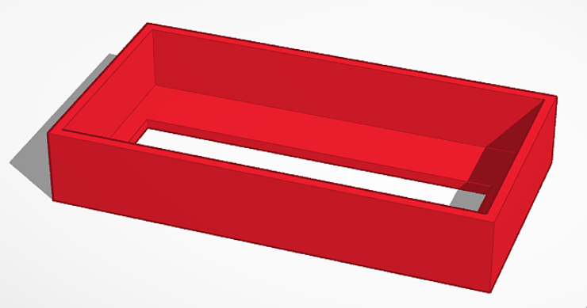

# Mole game

This is a simple reaction speed game with 10 light up buttons.
If you look at the files in this repo you can find the circuit diagram
and the source code you can use to recreate this project. There are also
other files related to the project.

Here is a youtube video showing how it works
[https://youtu.be/6zICtdC4Y2E](https://youtu.be/6zICtdC4Y2E)

## Images

